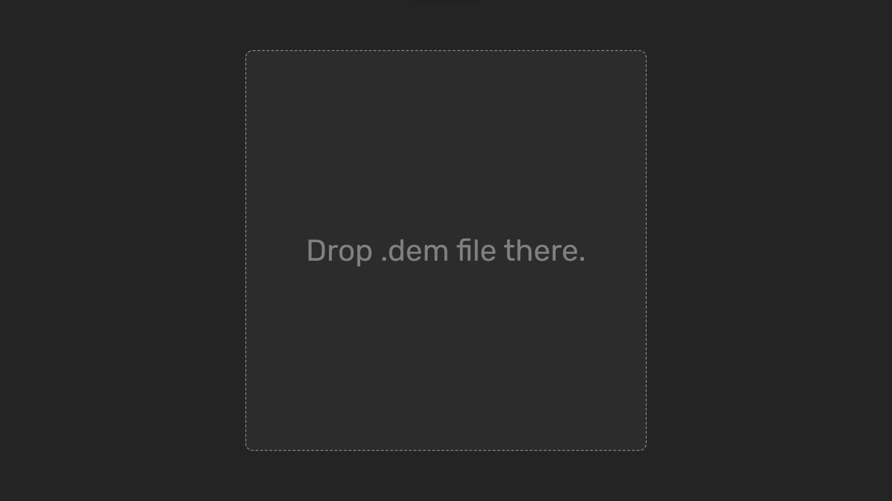
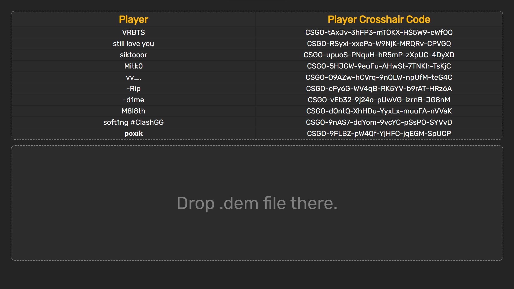

   
# CSGO Crosshairs from Demo (v1)
-What is that?

-This is a solution that will help you get the crosshair codes (CSGO-00000-00000-00000-00000-00000) of all players in a match using a demo file (.dem)!
Just Drag&Drop .dem file, select crosshair code and press on to copy it .

If something goes wrong, just reload the page :D

 

## Screenshots  
  
  
